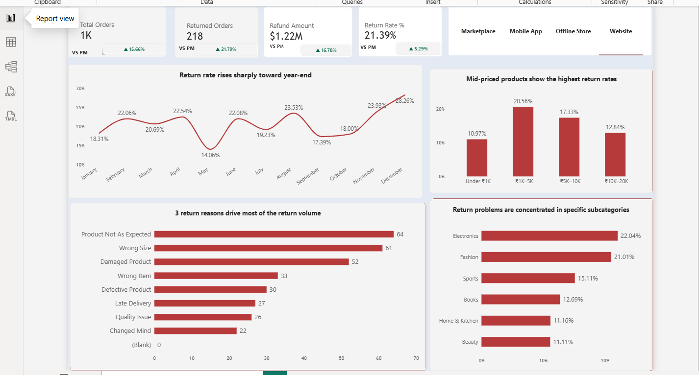
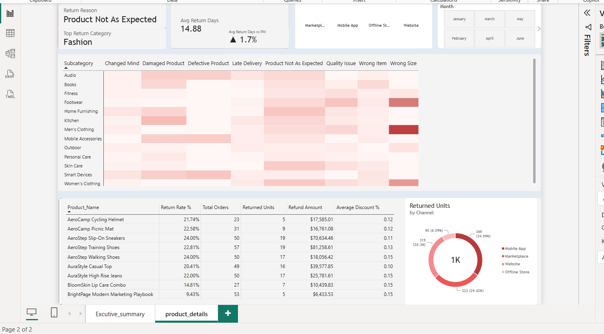

# E-commerce Product Return Analysis Using AI Assistant

### Decision-Driven Data Analytics | Power BI · DAX · Excel · Claude AI · MCP

> **Business decision:** Which return problems should the business fix first to reduce customer returns and refund exposure?

## 1. Business Problem

An e-commerce business is experiencing product returns and refunds. The objective is to identify where returns are concentrated, understand the main return reasons and patterns, prioritize the biggest problems, and recommend targeted fixes.

## 2. Analysis Requirements

### 2.1 Categorisation
- Group return reasons into clear categories.
- Count returned units for each category.

### 2.2 Pattern Analysis
- Identify product categories/types with the highest return rate.
- Identify the most common return reason.
- Analyze return patterns by price range.
- Analyze monthly/time-based return patterns.

### 2.3 Root-Cause Assessment
- For the priority return problems, assess whether the likely issue relates to the product, listing/PDP, packaging, or logistics.
- Root-cause conclusions are treated as hypotheses because the dataset does not contain direct customer feedback or operational evidence.

### 2.4 Recommendations
- Recommend one specific fix for each priority problem.
- Prioritize fixes using return volume, return rate, and financial exposure.

## 3. Decision

**Which return problems should the business fix first to reduce customer returns and refund exposure?**

The analysis follows:

**Business Problem → Decision → Metrics → Analysis → Insight / Why → Recommendation → Success KPI**

## 4. North Star Metrics

| Metric | Definition | Why it matters |
|---|---|---|
| Return Rate % | Returned Orders ÷ Total Orders | Overall return-risk signal |
| Returned Units | Sum of returned quantity | Measures return volume |
| Refund Amount | Derived refund exposure from returned quantity, paid price and refund deduction | Measures financial impact |
| Average Return Days | Return Date − Delivery Date | Shows return timing |

## 5. Executive Findings

- **745 of 3,100 orders were returned → 24.03% return rate.**
- **1,113 units were returned.**
- **Product Not As Expected (228), Wrong Size (217), and Damaged Product (184)** are the top three return reasons and account for **629 returned units / 56.5%** of all returned units.
- **Fashion** has the highest category return-rate pattern in the analysis.
- Price-band and monthly analysis were used to look for concentration and time-based patterns.
- Root-cause recommendations are hypotheses to test, not proven causal conclusions.

## 6. Key Insights → Business Meaning

### Insight 1 — Returns are concentrated in three major reasons
The top three return reasons account for **56.5% of returned units**, creating a clear opportunity to focus improvement work rather than treat every return reason equally.

### Insight 2 — Category performance differs
Return-rate patterns vary by product category, helping identify where merchandising, product or customer-experience investigations should be concentrated.

### Insight 3 — Return patterns should be evaluated by both volume and rate
A product or category can have high return volume because of high sales volume, so return rate and returned units should be considered together.

### Insight 4 — Financial exposure adds another prioritization lens
Refund exposure helps distinguish high-volume problems from problems that create larger financial impact.

## 7. Recommendations

| Priority | Problem | Specific fix | Stakeholder | Success KPI |
|---|---|---|---|---|
| 1 | Product Not As Expected | Improve product-page images, descriptions and specifications | Merchandising / Content | Product Not As Expected rate |
| 2 | Wrong Size | Improve size charts and fit guidance | Fashion / Merchandising | Wrong Size rate |
| 3 | Damaged Product | Audit packaging and delivery/handling for high-damage products | Operations / Logistics | Damage return rate + Refund Amount |

These fixes are prioritized because the three problems generate the largest concentration of returned units. Financial exposure is used as an additional prioritization lens.

## 8. What the Data Does Not Support

The dataset can show return patterns and priorities, but it cannot prove the **actual** operational root cause of each return. Claims such as “packaging caused the damage” or “the listing caused the mismatch” require additional evidence.

The project therefore uses **evidence-based root-cause hypotheses** and recommends what the business should validate next.

## 9. Dashboard

### Page 1 — Executive Decision View

Answers: **What is happening with returns?**

- North Star KPI cards
- Monthly return trend
- Return reason analysis
- Category performance
- Channel context
- Business filters

### Page 2 — Diagnostic / Action View

Answers: **Where should we investigate next?**

- Average Return Days
- Product performance
- Top category / reason
- Subcategory × Return Reason
- Discount vs Return Risk
- Product detail

### Dashboard Evidence





## 10. Data Quality & Assumptions

- Dataset covers **1 Jan 2025–31 Dec 2025**.
- Raw dataset contains **4,286 order-line rows**.
- There are **3,100 unique orders**, **104 products** and **850 customers**.
- One row represents a product line within an order.
- `Order_ID` can repeat, so order-level KPIs use `DISTINCTCOUNT(Order_ID)`.
- A returned order is identified using `Return_Quantity > 0`, giving **745 returned orders / 24.03%**.
- Return reasons are standardized before aggregation.
- `Return Days` = `Return_Date − Delivery_Date`.
- Refund Amount is derived from returned quantity, paid price after discount and refund deductions.

## 11. AI-Assisted Workflow

Claude was used as an **analytical assistant** for data exploration, Power BI semantic-model inspection through MCP, DAX development/debugging, validation and hypothesis development.

The analyst remained responsible for the business question, KPI definitions, analysis design, interpretation, prioritization and final validation.

## 12. Portfolio Evidence

- [`docs/PORTFOLIO_STORY.md`](docs/PORTFOLIO_STORY.md) — decision-driven project story
- [`analysis/ANALYSIS_NOTES.md`](analysis/ANALYSIS_NOTES.md) — analytical evidence
- [`analysis/BUSINESS_RECOMMENDATIONS.md`](analysis/BUSINESS_RECOMMENDATIONS.md) — recommended actions
- [`data/DATA_DICTIONARY.md`](data/DATA_DICTIONARY.md) — field definitions
- [`docs/PROJECT_SCOPE.md`](docs/PROJECT_SCOPE.md) — project scope
- [`powerbi/README.md`](powerbi/README.md) — dashboard explanation
- [`powerbi/dax/MEASURES.md`](powerbi/dax/MEASURES.md) — DAX evidence
- [`PowerBI_Claude_MCP_Setup_Guide.pdf`](PowerBI_Claude_MCP_Setup_Guide.pdf) — AI/MCP setup evidence

## 13. Repository Structure

```text
├── README.md
├── .gitignore
├── PowerBI_Claude_MCP_Setup_Guide.pdf
├── analysis/
│   ├── ANALYSIS_NOTES.md
│   └── BUSINESS_RECOMMENDATIONS.md
├── data/
│   ├── DATA_DICTIONARY.md
│   └── README.md
├── excel/
│   ├── Book1.csv
│   └── README.md
├── powerbi/
│   ├── README.md
│   ├── Return analysis.pbix
│   └── dax/
│       └── MEASURES.md
├── screenshots/
│   ├── README.md
│   ├── excuctive_summary.png
│   └── Product_details.png
└── docs/
    ├── PORTFOLIO_STORY.md
    ├── PROJECT_SCOPE.md
    └── RESUME_BULLETS.md
```

## 14. Next Step

**What I'd build next:** automated weekly return reports so the e-commerce team can track return-rate changes, top return reasons, returned units and refund exposure on a recurring basis.

## Interview Summary

> “I treated product returns as a business decision problem rather than only a dashboard exercise. I categorized return reasons, analyzed return rate by product category, price range and time, identified the three biggest return drivers, and used returned units, return rate and financial exposure to prioritize fixes. I then translated those findings into specific actions for merchandising and operations, while keeping root-cause statements as hypotheses because the available data cannot prove causality.”

## Author

**Jitender Yadav**  
Data Analyst | SQL | Power BI | Excel | Business Analytics
